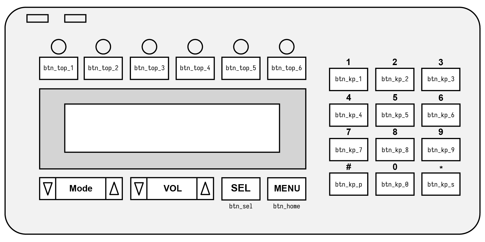
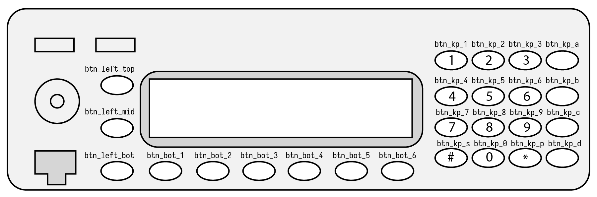

# SB9600 Daemon Configuration

SB9600 is the internal radio control protocol used by many Motorola radios from the mid-80s through to the early 2000s.

### Control Heads Supported

The following radios can be controlled using the SB9600 control mode:

- Astro Spectra radios/consolettes with W9 control heads (`controlHeadType: 0`)
- XTL5000 radios/consolettes with W9 control heads (`controlHeadType: 0`)
- MCS2000 radios with M3 control heads (`controlHeadType: 1`)

A Radio Interface Box (RIB) is required to convert the differential SB9600 signal into standard serial. W3AXL created the [MiniRIB USB](https://store.w3axl.com/products/minirib-usb)
as a compact, low cost device for interfacing SB9600 radios directly to USB ports, however any RIB can be used as long as it connects to a standard serial port.

### Serial Port

The serial port name used depends on the operating system the daemon is running in. For Windows systems, use the `COMx` format (i.e. `COM1`, `COM2`, etc). For Linux machines,
use the `/dev/ttyX` format (`/dev/ttyS0`, `/dev/ttyUSB0`, etc).

### Softkey Bindings

Once you've configured your softkey bindings [as described in the previous section](daemon-config.md#softkeys), you must bind them to physical radio buttons. This will depend
on how you've programmed your radio button mappings in your codeplug. Reference control head images are below to cross-reference button names in RC2 with the buttons on each
control head.

```yaml
# Softkey button binding (maps SB9600 buttons to configured softkeys below)
softkeyBindings:
    # Each entry is in the format sb9600 button name: softkey name
    #   valid SB9600 buttons can be found in the configuration documentation
    btn_top_1: MON
    btn_top_2: LPWR
    btn_top_3: SCAN
    btn_top_4: DIR
    btn_top_5: SEC
    btn_top_6: 
    btn_kp_1: CALL
    btn_kp_2: PAGE
    btn_kp_3: TGRP
    btn_kp_4: 
    btn_kp_5: 
    btn_kp_6: 
    btn_kp_7: 
    btn_kp_8: 
    btn_kp_9: 
    btn_kp_s: RCL
    btn_kp_0: 
    btn_kp_p: DEL
    btn_home: HOME
    btn_sel: SEL
```

See the button names below for the appropriate control head:

#### W9 Head Button Naming



#### M3 Head Button Naming



### Full Example Configuration

```yaml
# Radio control configuration
control:
    # Control Mode
    controlMode: 2 # SB9600

    # SB9600 configuration
    sb9600:
        # Serial port name (COMx on Windows, /dev/ttyX on linux)
        serialPort: "/dev/ttyS0"
        # Control head type
        #   0 - Astro W9 head (Astro spectra or XTL5000)
        #   1 - MCS2000 M3 Head
        controlHeadType: 0
        # Softkey button binding (maps SB9600 buttons to configured softkeys below)
        softkeyBindings:
            # Each entry is in the format sb9600 button name: softkey name
            #   valid SB9600 buttons can be found in the configuration documentation
            btn_top_1: MON
            btn_top_2: LPWR
            btn_top_3: SCAN
            btn_top_4: DIR
            btn_top_5: SEC
            btn_top_6: 
            btn_kp_1: CALL
            btn_kp_2: PAGE
            btn_kp_3: TGRP
            btn_kp_4: 
            btn_kp_5: 
            btn_kp_6: 
            btn_kp_7: 
            btn_kp_8: 
            btn_kp_9: 
            btn_kp_s: RCL
            btn_kp_0: 
            btn_kp_p: DEL
            btn_home: HOME
            btn_sel: SEL
```