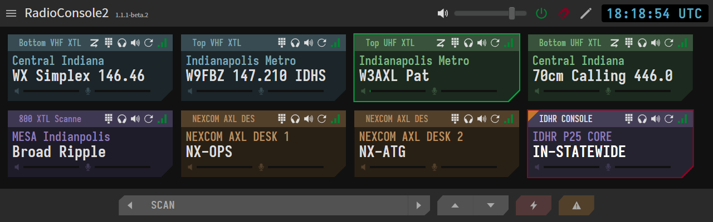

# RadioConsole2 Documentation



RadioConsole2 (shortened as RC2) is an open-source radio dispatch console system created by
[W3AXL](https://github.com/W3AXL). The intent of the system is to allow for remote operation
of two-way radios using a modular and expandable IP-based control system.

## Table of Contents

```{tableofcontents}
```

## RC2 Overview

Below is an overview of RC2, its interfaces, and its basic architecture.

```{mermaid}
:config: {"theme": "base", "darkMode": "true"}
:alt: RadioConsole2 System Architecture
:caption: RadioConsole2 System Architecture

%%{
  init: {
    'theme': 'base',
    'themeVariables': {
      'lineColor': '#aaa'
    }
  }
}%%

flowchart TD
    subgraph "`**Console Control Interfaces**`"
    
    midi-controller{{"`
    **MIDI Controller**
    *PTT/Volume/Select*
    `"}}

    serial-ptt{{"`
    **Serial Port**
    *PTT via CTS Line*
    `"}}

    extension-port{{"`
    **Custom Extension**
    *Control via Websocket*
    `"}}

    end

    console("`
    **Console Client App**
    *rc2-console*
    `")
    
    subgraph "`**Daemon Control Modes**`"

    sb9600-daemon["`
    **Radio Control Daemon**
    *SB9600 Control Mode*
    `"]
    xcmp-daemon["`
    **Radio Control Daemon**
    *XCMP Control Mode*
    `"]
    cm109-daemon["`
    **Radio Control Daemon**
    *CM109 Control Mode*
    `"]

    end
    
    sb9600-radio[/"`
    **Motorola Radio**
    *SB9600 Control*
    `"/]
    xcmp-radio[/"`
    **Motorola Radio**
    *XCMP Control*
    `"/]
    cm109-radio[/"`
    **Generic Radio**
    *CM109 Control*
    `"/]
    rc2-dvm["`
    **DVM FNE Interface**
    *rc2-dvm*
    `"]
    dvm-fne[("`
    **DVMProject FNE**
    `")]

    midi-controller <-- MIDI --> console
    serial-ptt <-- Serial --> console
    extension-port <-- Websocket --> console

    console <-- WebRTC --> sb9600-daemon <-- Serial Port --> sb9600-radio
    console <-- WebRTC --> xcmp-daemon <-- Serial/USB --> xcmp-radio
    console <-- WebRTC --> cm109-daemon <-- CM109 Soundcard --> cm109-radio
    console <-- WebRTC --> rc2-dvm <-- FNE Peer Connection --> dvm-fne
```

- **Remote Control of Radios**
    - Motorola Astro, XTL, APX, and TRBO radios
    - Generic radio control via 4-Wire E&M or Tone Remote
    - Direct connection to DVMProject FNE networks
- **Standard Dispatch Console Functionality**
    - Multi-Receive
    - Dynamic Panning
    - Realtime TX/RX status
    - Alert Tone Encoding
- **Expandable Control**
    - MIDI control of PTT, Volume, and Channel Select
    - Serial PTT for footswitch support
    - Websocket extension interface
